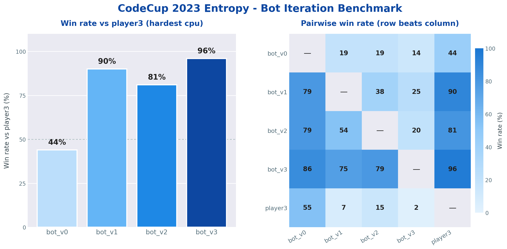

<h1 align="center">CodeCup 2023 — Entropy</h1>
<p align="center">A minimax implementation for the Entropy board game</p>

<p align="center">
  
  
  
</p>

A revisited improved implementation of my old [CodeCup 2023 - Entropy](https://archive.codecup.nl/2023/index.html) bot built entirely using C++.

You can read through the rules of the competition [here](https://archive.codecup.nl/2023/entropy/rules.html).

> **Result:** `bot_v3` wins **96 %** of games against `player3` (strongest given CPU).

---

## Build and run

To build the bot:

```bash
g++ -std=gnu++17 -O2 -Wall src/main.cpp -o bot
```

To actually run a match you need the caia harness (driver + manager + referee). Download and setup instructions are linked [here](https://archive.codecup.nl/2023/41/download_caia.html).

Once caia is set up, drop the built binary into the `bin/` directory and reference it from your `manager.txt`.

---

## Iteration history

| Version  | Max depth | What it added                                             |
| -------- | --------- | --------------------------------------------------------- |
| `bot_v0` | 2         | Minimax + alpha-beta. Strings for row/col representation. |
| `bot_v1` | 3         | Move ordering (whole-board scan) + integer eval.          |
| `bot_v2` | 3         | Sharper move ordering (only affected rows/cols scanned).  |
| `bot_v3` | 3–4       | Iterative deepening, 500 ms / move.                       |

---

## Benchmark



A full round-robin was held between all bot versions and `player3` (the strongest shipped CPU). 100 games per matchup, split evenly across both first-mover assignments. Heatmap reads **row beats column**.

---

## What I'd try to add next

- **Guarantee depth 4 search** - adding an heuristic approach, more precise ordering for better pruning
- **Bitboards implementations** - 7 x uint64_t for the whole board, faster row/col scans
- **Optimize using Transposition table (Zobrist hashing)**

---

## License

MIT — see [LICENSE](LICENSE).
